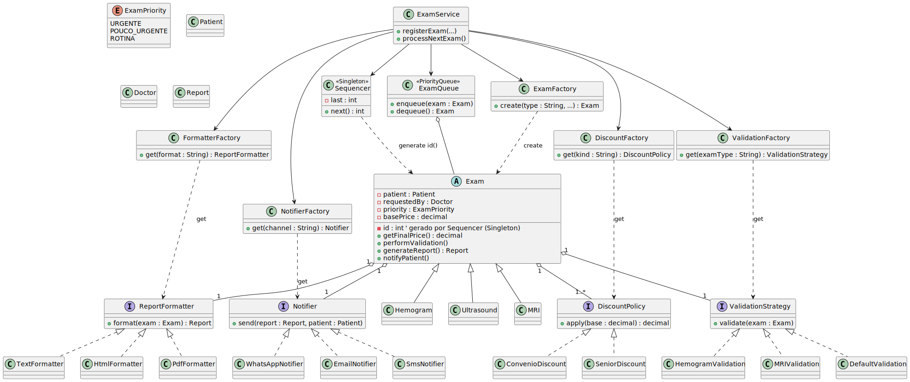

# 🧪 Sistema de Gerenciamento de Exames Médicos – IF Diagnósticos

Este projeto é parte da disciplina de **Padrões de Projeto**, com o objetivo de desenvolver um sistema flexível, extensível e de fácil manutenção para o gerenciamento de exames médicos e emissão de laudos.

---

## 📌 Objetivo

Atender os requisitos da empresa **IF Diagnósticos**, simulando um sistema real que permita:

- Gerenciar diferentes tipos de exames (Hemograma, Ultrassonografia, Ressonância...)
- Validar os exames com regras específicas
- Gerar laudos em múltiplos formatos (Texto, HTML, PDF)
- Notificar o paciente automaticamente
- Calcular preços com descontos dinâmicos
- Processar exames com diferentes níveis de urgência

---

## 📘 Requisitos Funcionais Atendidos

- **R1**: Leitura de dados via CSV  
- **R2**: Geração de número sequencial único de exames  
- **R3**: Inclusão de novos tipos de exame sem impactar o código  
- **R4**: Geração de laudos em múltiplos formatos  
- **R5**: Regras de validação específicas por tipo de exame  
- **R6**: Notificações via WhatsApp (e futuros canais)  
- **R7**: Políticas de desconto configuráveis  
- **R8**: Processamento por prioridade (URGENTE > POUCO_URGENTE > ROTINA)  
- **R9**: Programa principal com simulação de execução  
- **R10**: (Extra) Possibilidade de uso de Decorator ou Proxy para extensões futuras  

---
## 🧩 Padrões de Projeto Utilizados

### ✅ Singleton  
- **Classe:** `Sequencer`  
- **Como funciona:** Garante que apenas uma instância exista para gerar IDs únicos e sequenciais.  
- **Requisito atendido:** **R2** – Geração de número sequencial para exames, sem repetição.  
- **Como resolve o problema:** Centraliza a geração dos números de exame em um único ponto, garantindo unicidade e controle.

---

### ✅ Factory Method / Abstract Factory  
- **Classes:** `ExamFactory`, `FormatterFactory`, `NotifierFactory`, `ValidationFactory`, `DiscountFactory`  
- **Como funciona:** Encapsula a criação de objetos, permitindo instanciar tipos diferentes com base em parâmetros.  
- **Requisitos atendidos:** **R3, R4, R5, R6, R7**  
- **Como resolve o problema:** Permite adicionar novos exames, validadores, formatos de laudo, notificações e políticas de desconto **sem alterar o código existente**, promovendo extensibilidade e baixo acoplamento.

---

### ✅ Strategy  
- **Interfaces:** `ValidationStrategy`, `ReportFormatter`, `Notifier`, `DiscountPolicy`  
- **Como funciona:** Permite trocar comportamentos em tempo de execução através de classes que implementam uma mesma interface.  
- **Requisitos atendidos:** **R4, R5, R6, R7**  
- **Como resolve o problema:** Facilita a personalização das regras de validação, formatos de laudo, formas de notificação e políticas de desconto de forma independente, com código modular.

---

### ✅ Priority Queue  
- **Classe:** `ExamQueue`  
- **Como funciona:** Estrutura de dados que ordena os exames de acordo com sua prioridade (urgente > pouco urgente > rotina).  
- **Requisito atendido:** **R8** – Processamento baseado na urgência do exame.  
- **Como resolve o problema:** Garante que exames urgentes sejam processados antes dos demais, melhorando o tempo de resposta para casos críticos.

---

### ✅ Facade  
- **Classe:** `ExamService`  
- **Como funciona:** Fornece uma interface simples para um subsistema complexo, encapsulando a lógica interna.  
- **Requisito atendido:** **R9** – Execução integrada do sistema.  
- **Como resolve o problema:** Simplifica o controle da aplicação e integra os componentes (fábricas, estratégias, fila) em uma única interface de alto nível.

---

### ✅ Decorator (ou Proxy – opcional para R10)  
- **Como funciona:** Permite adicionar responsabilidades de forma dinâmica a objetos (Decorator) ou controlar o acesso (Proxy).  
- **Requisito atendido:** **R10** – Novo comportamento adicionado sem impactar o código anterior.  
- **Como resolve o problema:** Exemplo: empilhar múltiplos descontos com decorators ou gerar laudos em PDF sob demanda com proxy, sem alterar a lógica base.

---

## 🖼️ Diagrama de Classes

